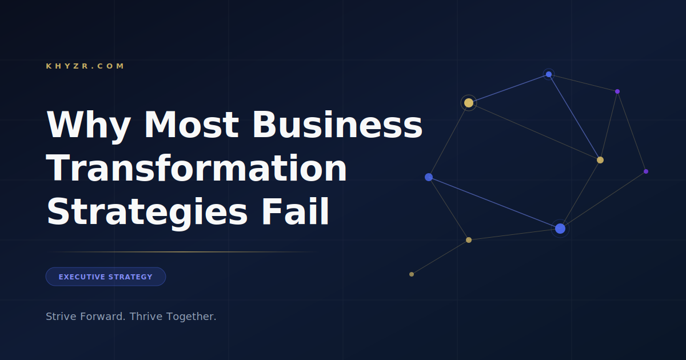

**SEO Title:** Why Most Business Transformation Strategies Fail
**Meta Description:** 70% of transformation initiatives fail — not from bad strategy, but from misaligned leadership. Here's the honest diagnosis and what to do instead.
**Slug:** /why-business-transformation-strategies-fail
**Primary Keyword:** business transformation strategy
**Practice Area:** Executive Strategy & Transformation
**Scheduled:** 2026-03-25 (Monday)

---

# Why Most Business Transformation Strategies Fail

Your transformation program has a roadmap, an executive sponsor, and a kickoff deck that got a standing ovation. Eighteen months from now, statistically speaking, it will have quietly stalled.

McKinsey puts the failure rate at 70%. Kotter's research says 8 out of 10 major change initiatives don't deliver their intended results. The programs that fail aren't usually badly designed. They're badly grounded — and the gap shows up long before execution begins.

---

## The Root Cause Isn't Strategy. It's Alignment.

Ask most executives why transformations fail and you'll hear the usual suspects: poor execution, insufficient budget, resistance to change, technology problems.

These are symptoms. The root cause is almost always earlier and more fundamental: **leadership isn't aligned on what "transformation" actually means for the business.**

We've seen this repeatedly. A company launches a business transformation strategy with a beautifully phased roadmap — workstream owners, executive sponsors, governance structures. Twelve months in, the initiative has quietly become a different initiative. Scope has crept. Priorities have shifted. The leadership team that signed off on Plan A is now implicitly executing Plan B, with no one willing to say it out loud.

The transformation didn't fail in execution. It failed the moment the leadership team left the planning room with different mental models of what success looked like.

---

## The Three Alignment Gaps That Kill Transformations

Our diagnostic work across industries consistently surfaces three gaps that derail even well-resourced transformation efforts:

**The Reality Gap.** Leadership is operating on different versions of the current state. The CEO has one picture of operational performance. The COO has another. The CFO has a third. These aren't minor variations — they're structurally different views of where the business actually is today. You can't align on a destination if you're starting from different maps.

**The Priority Gap.** Transformation programs typically carry 6–12 major workstreams. In theory, all are essential. In practice, bandwidth is finite — and when trade-offs hit (they always do), implicit priority hierarchies take over. If those hierarchies haven't been made explicit upfront, different parts of the organization will make different trade-off decisions. You end up with a fragmented program that satisfies no one and delivers nothing cleanly.

**The Adoption Gap.** This is where most post-mortems focus, but it's a last-mile problem, not a root cause. Change management and communication plans matter — but if the first two gaps aren't closed, no amount of change management saves you. Real adoption happens when people understand *why*, believe leadership is aligned, and see that trade-offs are being made consistently with stated priorities.

---

## What a Business Transformation Strategy That Sticks Actually Looks Like

The organizations that navigate transformation successfully share a common pattern — not in technology choices or org structures, but in how leadership operates *during* the process.

**They build shared reality before anything else.** Before roadmaps, before workstreams, before external consultants begin assessing, the leadership team invests in building a common honest view of where the business actually stands. This means diagnostic work that goes deeper than existing reporting — surfacing the operational and financial realities that management decks tend to smooth over.

**They make the implicit explicit.** Strategic priorities, trade-off rules, decision rights, escalation paths — all of it gets documented and socialized, not assumed. When ambiguity hits, there's a reference point everyone trusts.

**They plan for resistance, not around it.** The most resilient programs build formal mechanisms for surfacing and addressing resistance — not as a threat to be managed, but as signal to be incorporated. The people closest to the work often have the most accurate read on what will and won't land.

**They measure adoption, not activity.** Programs that report on workstream completion are measuring the wrong thing. The right metrics track behavior change: are people actually working differently? Are the new systems being used as designed? Is the P&L moving in the direction the transformation was supposed to move it?

---

## A Practical Framework for Getting Alignment Right

If you're heading into a transformation — or trying to rescue one that's stalled — here's where to start:

1. **Diagnostic audit.** Map where leadership currently agrees and where they diverge. Don't assume alignment because no one is arguing out loud.
2. **Reality calibration session.** Bring leadership together specifically to build a shared view of current state. Use external facilitation if internal dynamics make candor difficult.
3. **Priority stack exercise.** Force-rank every major workstream. Define explicit trade-off rules for when resources compress — because they will.
4. **Contingency planning.** Identify the three most likely disruptions to the transformation timeline. Build response plans before you need them.
5. **Adoption metrics.** Define what behavioral change looks like for each workstream. Start tracking from day one, not after launch.

None of this is glamorous. It's the unglamorous work that determines whether the transformation actually delivers.

---

## The Bottom Line

Most transformation programs are fundamentally sound in design and fatally flawed in execution — not because the execution team failed, but because the foundation of shared leadership alignment was never properly built.

The companies that consistently execute transformation successfully aren't smarter or better resourced. They're more honest about the current state, more disciplined about priorities, and more committed to making change real rather than just announced.

**Ready to build a business transformation strategy your team will actually commit to?** Book a discovery call at [khyzr.com](https://khyzr.com) — no prep required, just a direct conversation about your situation.

---
*Published by Khyzr | Executive Strategy & Transformation*
